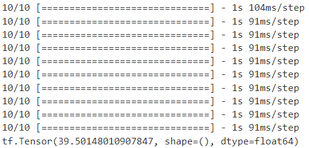

# SRIDNet - Super Resolution Image Denoiser Network 🌠

Welcome to **SRIDNet**, a lightweight yet powerful Convolutional Neural Network (CNN) model for **image denoising** that merges **super-resolution** and **denoising** techniques into a single architecture. Optimized for real-life applications, SRIDNet achieves impressive image clarity with a fraction of the computational load demanded by state-of-the-art models. 

## 🚀 Key Features

- **Dual-Stage Architecture**: Combines **Super Resolution** and **Autoencoder-based Denoising Blocks** to upscale and refine noisy images.
- **Compact Model**: With only ~460,000 trainable parameters, SRIDNet is remarkably smaller than conventional models, making it ideal for environments with constrained computational resources.
- **High Efficiency**: Delivers near state-of-the-art performance with minimal inference time.
- **Dataset Tested**: Trained and evaluated on **SIDD** and **Urban100** datasets, ensuring robustness across diverse, real-world noise levels.

## 🔍 Performance Highlights

- **Urban100 Dataset**:

  

  - Achieved **PSNR** (Peak Signal-to-Noise Ratio) averages of:
    - **34 dB** for σ=15
    - **32 dB** for σ=25
    - **28 dB** for σ=50

- **SIDD Dataset**:

  

  - Reached a remarkable **39.5 dB** average PSNR.
- **Inference Speed**:
  - Average inference time for a **256x256 image** is **0.0208 seconds** — substantially faster than most models in the field.

## ⚙️ Model Structure

SRIDNet comprises two primary blocks:

1. **Super Resolution Block**: Enhances image resolution by reconstructing high-frequency details lost in noisy images.

2. **Denoiser Block**: Utilizes a compact Autoencoder structure, eliminating noise effectively while maintaining fine details.

## 📊 Why SRIDNet?

SRIDNet strikes an ideal balance between **efficiency** and **effectiveness**, making it highly suitable for practical applications, especially where **computational resources are limited**. Its compact size and fast inference time open doors to real-time denoising tasks in resource-constrained environments, making SRIDNet a versatile tool for industries ranging from medical imaging to low-light photography.

## 📁 Dataset

The model was trained on the **SIDD (Smartphone Image Denoising Dataset)** and **Urban100** datasets, with images resized and augmented to simulate real-world noise.

## 📄 License

This project is licensed under the Apache 2.0 License. 

---

SRIDNet is here to make high-quality image denoising accessible and efficient. If you found this project useful, consider giving it a ⭐ on GitHub! Enjoy your journey in noise-free imaging with SRIDNet! 🎉