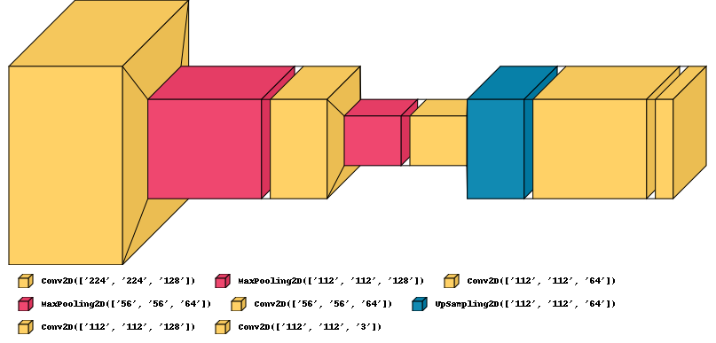
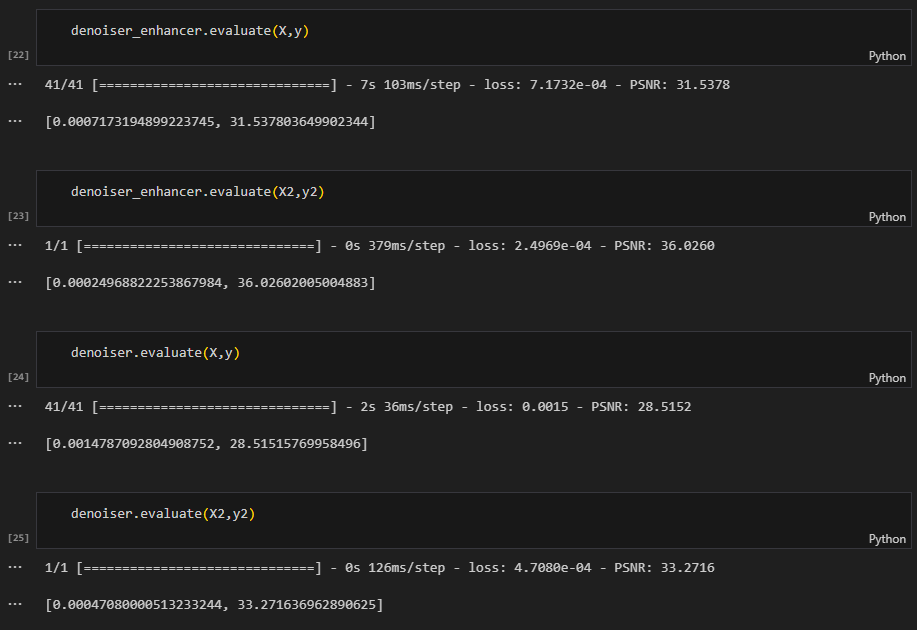
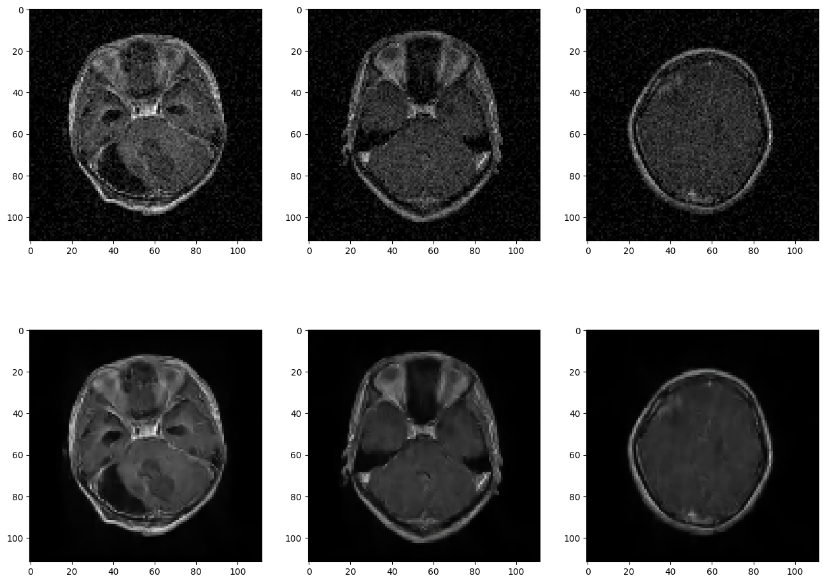
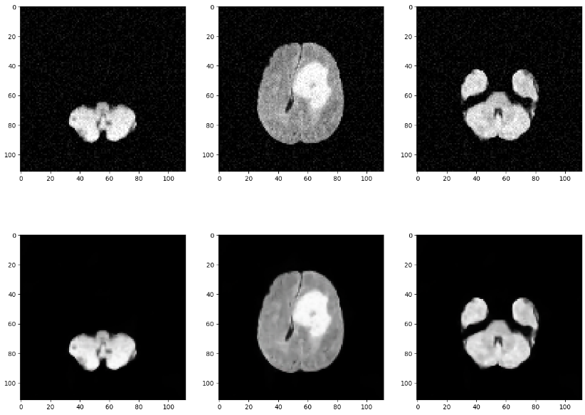

---

# 🧠 Denoising of MRI Images using CNN

**A CNN-based Approach to Denoise MRI Scans**

## 🚀 Overview

This project presents a convolutional neural network (CNN) architecture for the blind denoising of brain MRI images. The model leverages two key blocks: a **SuperResolution** module to upscale images and a **Denoiser** to enhance image quality while restoring the original dimensions. By combining these techniques, the model achieves superior performance in terms of image quality compared to traditional autoencoder-based methods.

## 🛠️ How It Works

1. **Input**: Original MRI image size is **(112, 112, 3)**.
2. **SuperResolution Block**: Upscales the input image to **(224, 224, 3)**.
3. **Denoiser Block**: Denoises the upscaled image while downscaling it back to the original dimensions **(112, 112, 3)**.
4. **Output**: The final image is cleaner and free from noise, significantly improving MRI quality.

**Super-Resolution Block**

**Denoiser Block**

This combination of upscaling and downscaling not only denoises but also retains critical features in the brain MRI scans.

## 📊 Comparisons & Results

The model was trained on **5,712 MRI images** and tested on two separate test sets of **3,762** and **1,311 images**, respectively.

- **Proposed Model (denoiser_enhancer)**:
  - **PSNR**: 31.5 (Test Set 1), 36.0 (Test Set 2)
  - **Model Size**: 3,674 KB

- **Autoencoder Model (denoiser)**:
  - **PSNR**: 28.5 (Test Set 1), 33.3 (Test Set 2)
  - **Model Size**: 2,299 KB

  

   

  **Denoising of Giloma Images**

  

   

  **Denoising of Brain Tumor Images**
  
  

Despite a slightly larger model size, the proposed CNN significantly outperforms the autoencoder, offering a **+3 PSNR improvement** on both datasets while keeping the model lightweight.

## 🛠️ Technologies Used

- **TensorFlow** and **Keras** for model building and training.
- **Sci-Kit Learn** and **OpenCV** for data preprocessing and augmentation.

## 📈 Performance Metrics

- **PSNR (Peak Signal-to-Noise Ratio)** is used as the primary metric for image quality assessment.
- The model demonstrates a considerable leap in PSNR, indicating clearer and more accurate MRI images post-denoising.
